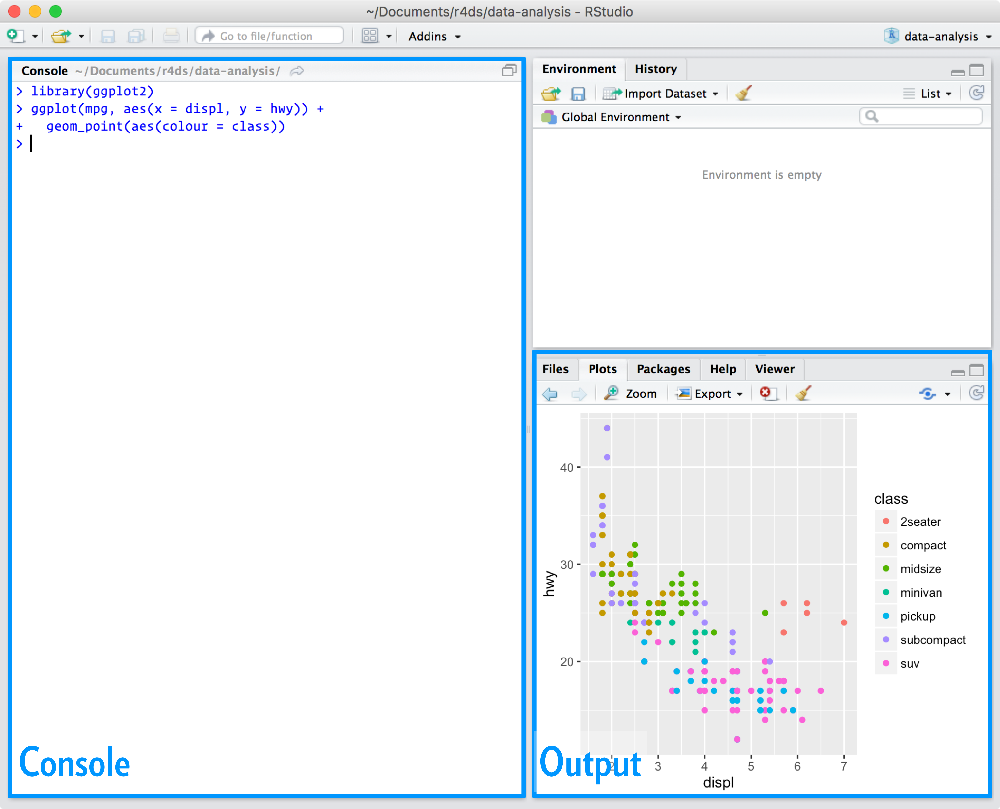

# Objectifs

Ce chapitre présente les fondamentaux du logiciels R. L'objectif est d'être en mesure de démarrer un projet *data science* qui s'articule autour des étapes suivantes.


1. *Import* (importer): Charger un fichier de données (.txt, .csv, ...) stocker sur votre disque dur ou accessible en ligne pour en faire un *data frame* exploitable avec R.
2. *Tidy* (ranger): Donner un structure cohérente aux données. *Cad* une colonne correspond à une variable et une ligne correspond à une observation. 
3. *Transform* (transformer): Modifier les données par exemple
    1. Sélectionner des observations (les habitants d'une ville donnée, les observations associées à une année)
    2. Créer de nouvelles variables par opérations sur des variables existantes. Opération arithmétiques mais aussi changer le format des données. 
    3. Calculer des statistiques descriptives en agrégeant les observations par groupes définis sur la base de critères (avoir 20 ans, être une fille ou un garçon, CSP)
4. *Visualisation*: Produire des graphiques
5. *Model* (modéliser): Faire une série d'hypothèse au sujet des données et des relations entre les variables. Procéder à une vérification. 
6. *Communicate*: Produire un document ou une présentation fain de rendre justice à vos résultats. Un exemple est le présent fichier qui est un *R notebook* utilisant [Markdown](https://github.com/adam-p/markdown-here/wiki/Markdown-Cheatsheet).

# Installation de R
## R
Rendez-vous sur [R project](https://cloud.r-project.org/), télécharger et suivez les instructions.

## R Studio
Il s'agit d'une interface pour faciliter l'usage de R. Rendez-vous sur [R Studio](https://www.rstudio.com/products/rstudio/download/). Il permet notament d'ouvrir le code source du présent fichier. En ouvrant R studio, vous verrez deux régions d'importance


La console permet de taper et de compiler du code ligne à ligne. Taper dans la console
```{r}
1 + 1
```
puis presser entrée!

## Créer un script

Le code R est généralement écrit dans un script qui commence par une en-tête comprenant les informations suivantes 

- nom du fichier (pas d'espace, plusieurs mots séparé d'un "_")
- introduction: Que fait ce script?
- auteur et contact
- date
- sources des données

```{r, eval = FALSE}
# seance1_R.r
# Mon premier script R qui explique les bases du langage

# Pierre-O Goffard pierre-olivier.goffard@univ-lyon1.fr
# 18/01/2021
# Les données proviennent de https://www.data.gouv.fr/fr/datasets/abonnes-aux-reseaux-sociaux-dissy-les-moulineaux/

```

Un script doit s'organiser en section de façon à pouvoir s'y retrouver facilement!

La première section permet par exemple de télécharger le jeu de donnée et de paramétrer le répertoire de travail.

```{r, eval = FALSE}
# importation des données ----
setwd(rstudioapi::getSourceEditorContext()$path)  # Le répertoire de travail est l'emplacement du fichier
download.file(url = "https://www.data.gouv.fr/fr/datasets/r/31da20b9-2637-4346-93c5-707f03371a05", destfile = 'issy.csv')  # Téléchargement du fichier depuis data.gouv
```

## Les Packages

Un package R est une collections de fonctions, de jeux de données et de documentation permettant d'étendre les fonctionalité de bases du logiciel. R est un logiciel *open source* (pas de license à payer) auquel chacun peut contribuer librement. On utilisera beaucoup le package *tidyverse*. 

```{r, eval = FALSE}
install.packages("tidyverse")
```

Il est impossible d'utiliser les fonctions disponibles dans le package avant de l'avoir charger via la commande 

```{r}
library(tidyverse)
```
Le package *actuar* est un package dédié aux sciences actuarielles. 
```{r, eval = FALSE}
install.packages("actuar")
library(actuar)
```

La documenation est disponible en ligne [actuar](https://cran.r-project.org/web/packages/actuar/actuar.pdf).

## Chercher de l'aide
La fonction help permet d'accéder à la documentation d'une fonction. 

```{r, eval = FALSE}
help(sum)
```

Lorsque vous êtes bloqué

 1. Demander à Google: Ajouter la lettre R à votre requête, n'hésitez pas à copier et coller un message d'erreur dans son intégralité 
 2. [Stackoverflow](https://stackoverflow.com/) est un forum très dynamique où des utilisateurs ont probablement déjà rencontré le problème auquel vous êtes confronté.
 
# Les bases du langages
## Les types d'objet

- null (objet vide) : **NULL**
- logical (booléen) : **TRUE** ou **FALSE**
- numeric (nombres réels): **1**, **2.3222**, **pi** ou **1e-10**
- complex (nombre complexe): **2+0i**, **2i**
- character (chaine de caractères): **'bonjour'**, **"K"**

On peut assigner une valeur à une variable via **<-** ou **=**. 

```{r}
# Variable a contenant une chaine de caractère
a = "Hello"
# Variable b contenant un nombre réel
b <- 52.148
```


On peut connaitre afficher la valeur d'une variable, 

```{r}
# Affichage de a 
a

```

connaitre son type

```{r}
#Type de a
typeof(a)
```

ou tester son appartenance à une classe. 

```{r}
# a est une chaine de caractère ou un nombre complexe
is.character(a)
is.complex(a)
```

## Valeur manquante 

Il arrive que des valeurs manquantes soient présentes dans un jeu de données, il est nécessaire de les traiter à part. Il arrive aussi que des calcul mène à des formes indéterminées, voic la liste de ces valeurs spéciales. 

- Not Available: **NA**
- Not a Number: **NaN**
- Infini: **Inf**

```{r, eval = TRUE}
0/0
exp(100000)
```


## Les vecteurs
Il existe plusieurs façon de créer un vecteur.

La fonction **c()**

```{r}
# Vecteur numériques
vec_num <- c(4, 17, 78, 1, 1.25)
# Vecteur de chaines de caractères
prenoms <- c("George", "Jean", "Brigitte")
```
```{r}
# Affichage de vec_num
vec_num
```
```{r}
#Affichage de prenoms
prenoms
```

On peut sélectionner les éléments des vecteurs en indiquant leur indice

```{r}
# 2eme élément de prenoms
prenoms[2]
```

L'opérateur **:** permet de créer un vecteur comme suite d'entiers successifs  

```{r}
# Les entiers successifs de 1 à 6
1:6
```

et de sélectionner plusieurs éléments à la fois.

```{r}
# Sélection élement 2 à 3
vec_num[2:3]
```
```{r}
# Sélection élement 4 et 6
vec_num[c(4, 6)]
```
```{r}
# Tous les élements sauf le premier
vec_num[-1]
```

La force de R réside dans le calcul vectoriel. La plupart des fonctions sont dites "vectorisées" au sens où leur application sur un vecteur renvoit un vecteur. 

```{r}
# logarithme du vecteur vec_num
log(vec_num)
```

Il est possible de générer un vecteur de booléen en testant les élément d'un vecteur.

```{r}
# L'opérateur == permet de tester l'égalité
prenoms == "Samy"
```

Cela permet notamment de sélectionner des élements qui satisfont un critère

```{r}
# Eléments supérieurs à 4
vec_num[vec_num > 4]
```

On peut combiner des conditions avec **&** (and) ou **|** (ou)

```{r}
# Eléments supérieurs à 4 et inférieurs ou égale à 70
vec_num[(vec_num > 4) & (vec_num <= 70)]
```

Certaines fonctions renvoit toutefois un scalaire 

```{r}
# Somme des élements d'un vecteurs
sum(vec_num)
```

C'est le cas des fonction permettant le calcul de statistiques descriptives. On peut également réaliser des opérations sur les vecteurs
```{r}
vec_1 <- c(1, 4, 7, 1)
vec_2 <- c(7, 2, 7, 4)
vec_1 + vec_2
```

Les vecteurs doivent être de dimension compatible 

```{r}
length(vec_1) == length(vec_2)
```
```{r}
# Produit scalaire des deux vecteurs
vec_1 %*% vec_2
```

Le résultat est une matrice...

## Les matrices

On peut définir une matrice en donnant le nombre de colonnes

```{r}
matrix(c(1,4,7,5,8,4), ncol = 2)
```

ou le nombre de lignes

```{r}
matrix(c(1,4,7,5,8,4), nrow = 2)

```

Lorsque le nombre d'éléments spécifiés est insuffisant, R remplit la matrice par répétition

```{r}
# Une matrice 2*4 avec que des 1
matrix(1, nrow = 2, ncol = 4)
```

On sélectionne naturellement les éléments en indiquant l'indice de ligne et de colonne

```{r}
m <- matrix(seq(0.5, 4, by = 0.5), ncol = 4, byrow = T )
m
```
```{r}
# 2eme ligne et 4eme colonne
m[2, 4]
```
```{r}
# 3eme colonne
m[ , 3]
```

Comme pour les vecteurs, on peut effectuer des calculs *elementwise* à l'aide des fonctions vectorisées

```{r}
# Sinus des élements de m
sin(m)
```
```{r}
# Deux matrice 2*2
A <- matrix(1:4, ncol = 2)
B <- matrix(5:8, ncol = 2)
# Produit élément par élement 
A*B
```
```{r}
# A ne pas confondre avec le produit des matrices, ici de A et de la transposée de B
A%*%t(B)
```

La function **eigen** permet de déterminer les valeur propres et les vecteurs propres d'une matrice

```{r}
#Valeurs propres et vecteurs propres de l amatrice identité de taille 5*5
eig <- eigen(diag(5))
eig
```

Cette fonction retourne les valeurs propres dans l'objet values et les les vecteurs propres dans l'objet vectors

```{r}
# Extraction du permier vecteur propre
eig$vectors[ , 1]
```

La fonction **det()** permet de calculer le déterminant, la fonction **solve()** permet de résoudre un système d'équations linéaires. On peut obtenir les dimensions d'un matrices

```{r}
dim(A)
```

le nombre de colonne

```{r}
ncol(A)
```

et le nombre de ligne 

```{r}
nrow(A)
```

La fonction **apply** permet d'appliquer des opérations pour chaque ligne ou chaque colonne

```{r}
# Moyenne par colonne
apply(B, MARGIN = 2, mean)
```
```{r}
#Somme par lignes
apply(B, MARGIN = 1, sum)

```

On peut créer des matrices en concaténant des vecteurs lignes 

```{r}
rbind(c(1, 2), c(3, 4))
```

ou des vecteurs colonnes

```{r}
cbind(c(1, 2), c(3, 4))
```

## Les data-frames

Les data-frames sont des matrices dont on a nommer les colonnes de façon à stocker des jeux de données avec les variables en colonne et les observations en ligne. 

```{r}
vec_1 <- 1:5
vec_2 <- rep('a',5)
df <- data.frame(nom.var1 = vec_1, nom.var2 = vec_2)
df
```

On peut faire référence aux colonnes d'un data-frame via leur nom.

```{r}
# Observations associées à la première variable
df$nom.var1
```

Il s'agit du format standard des jeux de données exemple souven inclut dans les packages

```{r}
library(MASS)
data(Insurance)
#help(Insurance)
```
```{r}
# Affichage des 5 premières observations
Insurance[1:5, ]
```

## Les listes 

Les listes sont des ensembles d'objets hétérogènes (de différents type). 

```{r}
# Création d'un vecteur 
vecteur <- seq(2, 10, by = 3)
# Création d'une matrice 
matrice <- matrix(1:8, nrow = 2)
# On place le vecteur et la matrice et le vecteur dans une liste
liste <- list(vecteur, matrice)
liste
```
```{r}
# Affichage du deuxième élément de la liste 
liste[[2]]
```

Il est possible de donner des noms aux éléments de la liste avec 

```{r}
names(liste) <- c("vec", "mat")
#Affichage de l'élément vec
liste
```
```{r}
# Affichage du vecteur
liste$vec
```

La fonction **eigen**, vue précédemment, renvoit en fait une liste d'objet nommés. La fonction **lapply()** permet d'appliquer une fonction à chacun des éléments d'une liste

```{r}
# Création d'une liste de liste contenant les prmière lettre et de l'alphabet et un indice
ma_liste = list(c("abcdef", 1), c("abcdef", 2),c("abcdef", 3), c("abcdef", 4), c("abcdef", 5), c("abcdef", 6))
ma_liste
```

Les valeurs numériques ont été convertis en caractères automatiquement pour que les types d'objet composant le vecteur soient les mêmes. 

```{r}
# Récupération des lettres correspondant aux indices dans les chaines de caractères pour chacun des éléments de la liste
resultat = lapply(ma_liste, function(l) substr(l[1], as.numeric(l[2]), as.numeric(l[2])))
resultat

```

Le résultat est une liste qui pourrait très bien être un simple vecteur, d'où

```{r}
unlist(resultat)
```

La fonction **lapply()** est un bon moyen de s'épargner le recours à une boucle **for** qui n'est généralement pas optimal tant du point de vue de la performance du code que de son esthétisme. 

Une fiche récapitulative est disponible en ligne [base R cheatsheet](https://www.rstudio.com/wp-content/uploads/2016/05/base-r.pdf).

# Importation d'un jeu de données

Importons le jeu de données télécharger précédemment à l'aide de la fonction **read.csv**.

```{r, eval = TRUE}
issy_df <- read.csv("issy.csv", sep=";", stringsAsFactors=TRUE)
head(issy_df)
```

 
# References

-  Grolemund, G. & Wickman, H. (2018). [R for Data Science](https://r4ds.had.co.nz/). O'Reilly.   
-  Cornillon, P. A., Husson, F., Jégou, N., Matzner-Lober, E., Josse, J., Guyader, A., ... & Kloareg, M. (2010). [Statistiques avec R](https://journals.openedition.org/lectures/8858). Presses universitaires de Rennes.
-  Charpentier, A.(2014). Computational actuarial science with R. CRC Press.


